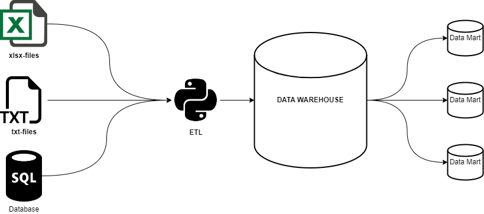

# Организация ETL/ELT-процесса с построением витрин данных.

Организация ежедневного сбора данных из различных источников, очистка, загрузка и преобразование данных в версионный формат хранения SCD2.

## Файловая структура проекта

**main.cron** - файл конфигурации демона cron для ежедневного запуска скрипта;

**main.ddl** - файл, описывающий создание структуры хранилища;

**main.py** - скрипт обработки данных на языке Python;

**файлы .xlsx, .txt** - тренировочный набор данных.

## Структура процесса обработки данных

## Описание задачи

Необходимо разарботать ETL-процесс, получающий ежедневную выгрузку данных, загружающий их в хранилище данных и ежедневно строящий отчет. Иными словами - создать скрипт **инкрементальной** загрузки с построением data marts.

### Выгрузка данных

Выгрузка данных имеет следующую структуру:
- Список банковских транзакций за текущий день в формате CSV;
- Список банковских терминалов, пердставленный полным срезом в формате XLSX;
- Список паспортов, которые включены в "черный список", с накоплением с начала месяца в формате XLSX.

## Структура хранилища данных

## Построение отчета

Ежедневно на основе загруженных данных требуется строить витрину отчетности о мошеннических операциях. Данная витрина строится накоплением, то есть каждый новый отчет по мошенничествам добавляется в таблицу со своим report_dt.

#### Признаки мошеннических операций

Мошеннические операции выявляются по следующим признакам:
1. Совершение транзакции при просроченном или *заблокированном* паспорте;
2. Совершение транзакции при недействующем аккаунте;
3. Совершение транзакций в разных городах в течение одного часа;
4. Попытка подбора суммы. Совершение 3-х и более последовательных операций по снятию/оплате в течение 20-ти минут, при этом все операции кроме последней отклонены и сумма уменьшается с каждой попыткой. Последняя (успешная) транзакция в такой цепочке будет считаться мошеннической.

#### Структура отчета

- *event_dt* - время выполнения транзакции;
- *passport* - номер паспорта клиента;
- *fio* - ФИО клиента;
- *phone* - номер телефона клиента;
- *event_type* - признак мошеннической операции;
- *report_dt* - время построения отчета.